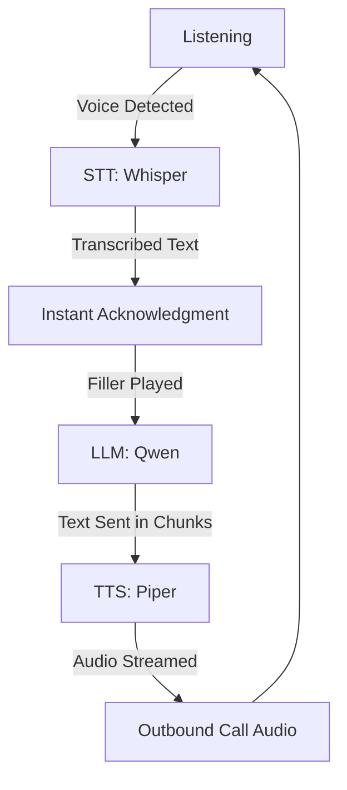

# AI Voice Agent: System Execution Guide

This guide explains the internal workflow of the voice agent when you execute `python -m voice_agent.main`.

## 1. Initialization Phase
When started, the system initializes four core modules:
- **TelephonyHandler**: Connects to your Android phone via ADB to handle dialing and call states.
- **AudioHandler**: Manages your computer's audio devices (Input/Output).
- **STT/TTS Engines**: Loads the Faster-Whisper (speech-to-text) and Piper (text-to-speech) models.
- **LLM Engine**: Connects to Ollama (Qwen) to handle the "brain" of the agent.

## 2. Hybrid Audio Selection
The system will ask you to select an **Input Device ID**:
- **Standard Microphone**: Used for local testing or if the phone's speaker is loud enough for your PC to hear.
- **Sndcpy (Virtual Virtual Sink)**: Used for high-quality, direct digital audio from the phone. You select the Sndcpy audio device here.

## 3. The Call Lifecycle
1. **Dialing**: The agent automatically dials the `TARGET_NUMBER` via ADB.
2. **Monitoring**: It polls the telephony state. The conversation only begins once the call status becomes "ACTIVE".
3. **Initial Greeting**: Once connected, the agent immediately says its first line: *"Hello, this is Mallikarjun from Whatypie..."*

## 4. The Processing Loop (The "Brain")
Once the call is live, the system enters a continuous loop:

### Key Mechanisms:
- **VAD (Voice Activity Detection)**: The `AudioHandler` monitors volume levels. If it hears sound above the `SILENCE_THRESHOLD`, it starts recording.
- **Instant Fillers**: To reduce the "awkward silence" while the LLM thinks, the agent randomly picks a response like *"Got it"* or *"I see"* to play immediately.
- **Sentence Streaming**: The LLM streams sentences one by one to the TTS engine. This means the agent starts speaking as soon as the first sentence is ready, rather than waiting for the full response.

## 5. Interruption Handling
This is a critical feature for natural conversation:
- If the agent is currently speaking but the `AudioHandler` detects a loud sound (the user speaking), it triggers an **Abort**.
- The `TTSEngine` immediately clears its queue and stops playback.
- The system then switches back to **Listening** mode to hear what the user said.

## 6. Shutdown
When you press `Ctrl+C` or the call is ended by the recipient:
- The system sends an ADB "Hangup" command.
- It safely closes all audio streams and kills background processes.
